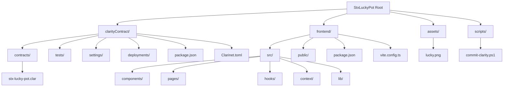
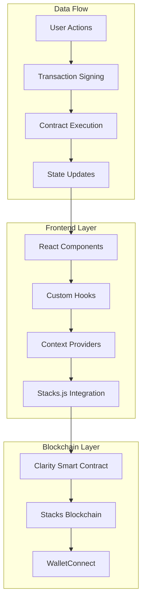
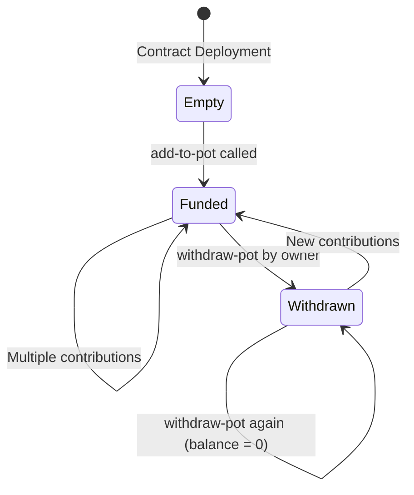
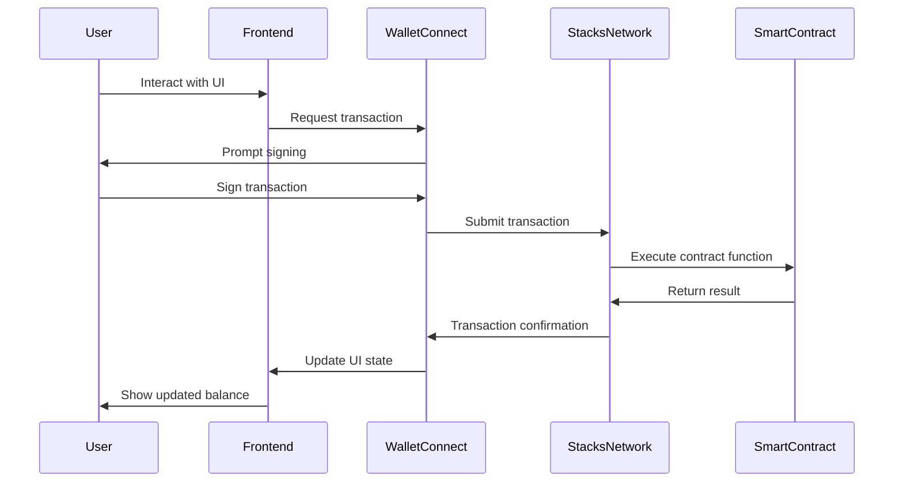

# StxLuckyPot

[](https://clarity-lang.org/)
[](https://stacks.co/)
[](https://reactjs.org/)
[](https://vitejs.dev/)
[](https://www.typescriptlang.org/)
[](LICENSE)


## Description

StxLuckyPot is a full-stack blockchain application built on the Stacks blockchain. It features a Clarity smart contract that implements a communal lucky pot system where users can contribute STX tokens, and a modern React-based frontend that provides an intuitive interface for interacting with the contract. The application demonstrates high-frequency STX transfers and integrates WalletConnect for decentralized authentication. The frontend leverages @stacks/connect for wallet integration, @stacks/network for blockchain connectivity, and @stacks/transactions for transaction management.

## Table of Contents

- [StxLuckyPot](#stxluckypot)
  - [Description](#description)
  - [Table of Contents](#table-of-contents)
  - [Features](#features)
  - [Project Structure](#project-structure)
  - [Architecture](#architecture)
    - [Contract Architecture](#contract-architecture)
  - [Integration](#integration)
  - [Prerequisites](#prerequisites)
  - [Installation](#installation)
  - [Usage](#usage)
    - [Running the Frontend](#running-the-frontend)
    - [Running Contract Tests](#running-contract-tests)
    - [Building for Production](#building-for-production)
  - [Development](#development)
    - [Project Setup](#project-setup)
    - [Code Quality](#code-quality)
    - [Commit Script](#commit-script)
  - [Testing](#testing)
    - [Contract Testing](#contract-testing)
    - [Frontend Testing](#frontend-testing)
  - [Deployment](#deployment)
    - [Contract Deployment](#contract-deployment)
    - [Frontend Deployment](#frontend-deployment)
  - [Contributing](#contributing)
    - [Guidelines](#guidelines)
  - [License](#license)

## Features

- **Smart Contract**: Clarity-based contract for STX pot management
- **Frontend Interface**: React application with modern UI components
- **Wallet Integration**: WalletConnect support for secure transactions
- **Real-time Updates**: Live balance and transaction monitoring
- **Responsive Design**: Mobile-friendly interface
- **Test Coverage**: Comprehensive unit tests for contract and frontend
- **Multi-network Support**: Testnet and mainnet configurations

## Project Structure

The project is organized into two main directories: the Clarity contract and the React frontend.



## Architecture

The application follows a layered architecture with clear separation between blockchain logic and user interface.



### Contract Architecture



## Integration

The frontend integrates with the Stacks blockchain through the Stacks.js library and WalletConnect protocol.



## Prerequisites

- Node.js (v18 or later)
- Clarinet CLI for contract development
- A Stacks-compatible wallet (e.g., Hiro Wallet, Xverse)
- Git

## Installation

1. Clone the repository:
   ```bash
   git clone https://github.com/cypherpulse/stxLuckyPot.git
   cd stxLuckyPot
   ```

2. Install frontend dependencies:
   ```bash
   pnpm install
   ```

3. Install contract dependencies:
   ```bash
   cd clarityContract
   npm install
   cd ..
   ```

## Usage

### Running the Frontend

```bash
pnpm dev
```

The application will be available at `http://localhost:5173`.

### Running Contract Tests

```bash
cd clarityContract
npm test
```

### Building for Production

```bash
pnpm build
```

## Development

### Project Setup

1. Start the development server:
   ```bash
   pnpm dev
   ```

2. In another terminal, start contract development:
   ```bash
   cd clarityContract
   clarinet console
   ```

### Code Quality

- ESLint for JavaScript/TypeScript linting
- TypeScript for type safety
- Vitest for unit testing
- Prettier for code formatting

### Commit Script

Use the provided PowerShell script to commit contract changes:

```bash
.\commit-clarity.ps1
```

## Testing

### Contract Testing

```bash
cd clarityContract
npm test
```

### Frontend Testing

```bash
pnpm test
```

## Deployment

### Contract Deployment

1. Configure your wallet in `clarityContract/settings/Testnet.toml`
2. Generate deployment plan:
   ```bash
   cd clarityContract
   clarinet deployments generate --testnet
   ```
3. Apply deployment:
   ```bash
   clarinet deployments apply --testnet
   ```

### Frontend Deployment

The frontend can be deployed to any static hosting service:

```bash
pnpm build
# Deploy the dist/ folder
```

## Contributing

1. Fork the repository
2. Create a feature branch: `git checkout -b feature/your-feature`
3. Make your changes
4. Run tests: `pnpm test` and `cd clarityContract && npm test`
5. Commit your changes: `git commit -m 'Add some feature'`
6. Push to the branch: `git push origin feature/your-feature`
7. Open a pull request

### Guidelines

- Follow the existing code style
- Add tests for new features
- Update documentation as needed
- Ensure all tests pass before submitting

## License

This project is licensed under the MIT License - see the [LICENSE](LICENSE) file for details.