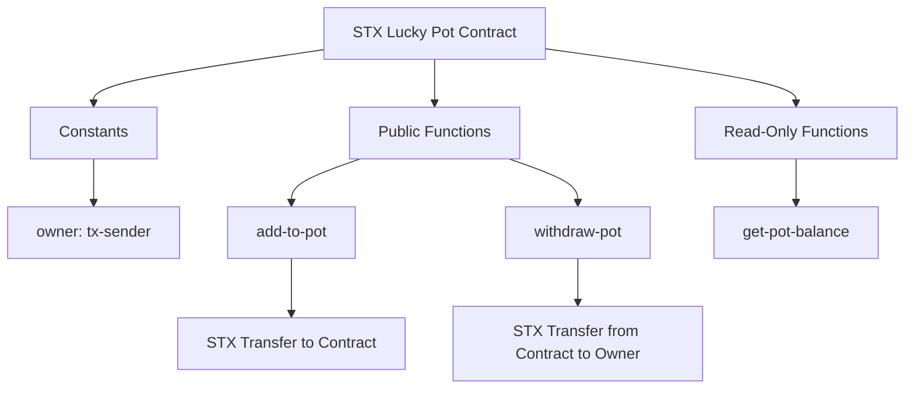
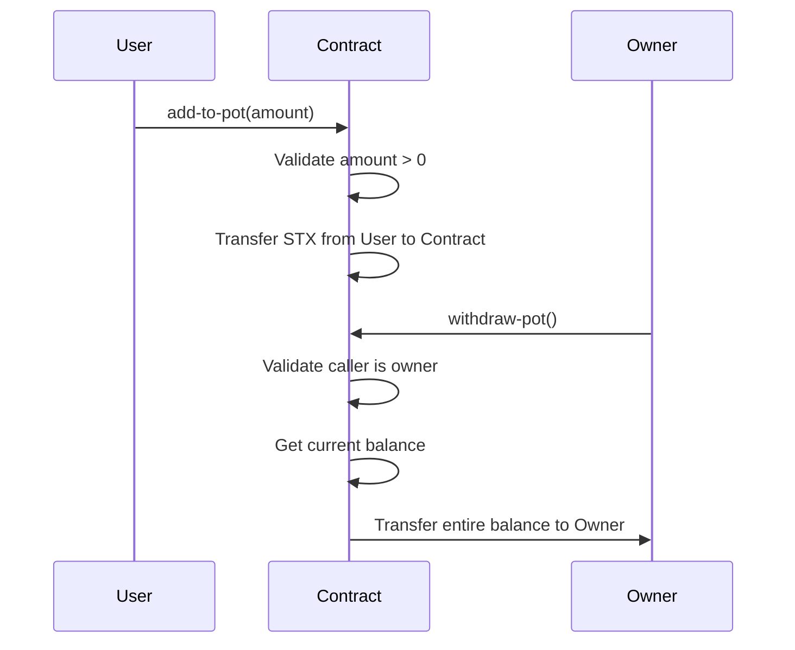
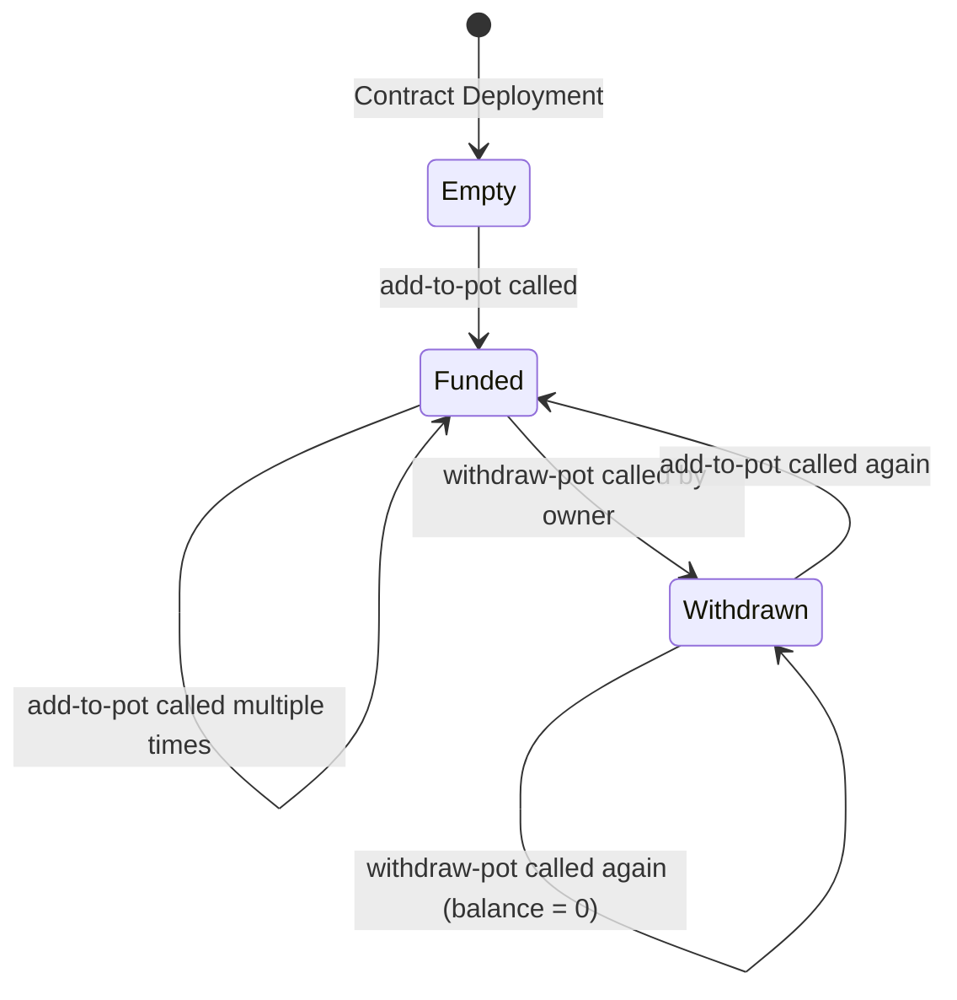

# STX Lucky Pot

[](https://clarity-lang.org/)
[](https://stacks.co/)
[](LICENSE)

A simple Clarity smart contract for a "Lucky Pot" on the Stacks blockchain, designed for maximum STX transfer activity. This contract allows users to contribute STX to a communal pot, with the owner having the ability to withdraw the entire balance at any time.

## Table of Contents

- [Overview](#overview)
- [Architecture](#architecture)
- [Features](#features)
- [Contract Functions](#contract-functions)
- [Deployment](#deployment)
- [Testing](#testing)
- [Development](#development)
- [Contributing](#contributing)
- [License](#license)

## Overview

The STX Lucky Pot contract implements a basic crowdfunding mechanism where:

- Any user can add STX to the pot
- The contract owner can withdraw the entire pot balance
- The current pot balance is publicly readable

This contract is designed for high-frequency STX transfers, making it suitable for gaming, lottery, or community funding applications on the Stacks blockchain.

## Architecture

### Contract Structure



### Data Flow



### State Management



## Features

- **Simple Contribution**: Any user can add STX to the pot with a single function call
- **Owner Control**: Contract deployer has exclusive rights to withdraw funds
- **Transparent Balance**: Public read-only function to check current pot balance
- **Error Handling**: Comprehensive validation with clear error codes
- **Gas Efficient**: Minimal operations for high throughput

## Contract Functions

### Constants

- `owner`: The contract deployer, set to `tx-sender` at deployment

### Public Functions

#### `add-to-pot(amount: uint)`

Adds STX to the lucky pot.

**Parameters:**
- `amount`: The amount of STX to add (must be > 0)

**Returns:**
- `(ok true)` on success
- `(err u1)` if amount is 0 or invalid

**Behavior:**
- Validates amount > 0
- Transfers STX from caller to contract using `stx-transfer?`

#### `withdraw-pot()`

Withdraws the entire pot balance to the owner.

**Parameters:** None

**Returns:**
- `(ok pot-balance)` on success, where pot-balance is the withdrawn amount
- `(err u2)` if caller is not the owner

**Behavior:**
- Validates caller is the owner
- Gets current contract STX balance
- Transfers entire balance to owner

### Read-Only Functions

#### `get-pot-balance()`

Returns the current STX balance of the contract.

**Parameters:** None

**Returns:**
- `uint`: Current STX balance in microSTX

## Deployment

### Prerequisites

- Clarinet CLI installed
- Stacks account with sufficient STX for deployment

### Testnet Deployment

1. Configure your testnet account in `settings/Testnet.toml`
2. Generate deployment plan:
   ```bash
   clarinet deployments generate --testnet
   ```
3. Apply deployment:
   ```bash
   clarinet deployments apply --testnet
   ```

### Mainnet Deployment

1. Update `settings/Mainnet.toml` with your mainnet account
2. Generate and apply deployment for mainnet:
   ```bash
   clarinet deployments generate --mainnet
   clarinet deployments apply --mainnet
   ```

## Testing

The contract includes comprehensive unit tests using Vitest and Clarinet SDK.

### Running Tests

```bash
npm install
npm test
```

### Test Coverage

- Initial balance verification
- Successful STX additions
- Multiple user contributions
- Owner withdrawal functionality
- Error handling for invalid inputs
- Access control validation

## Development

### Project Structure

```
clarityContract/
├── contracts/
│   └── stx-lucky-pot.clar    # Main contract
├── tests/
│   └── stx-lucky-pot.test.ts # Unit tests
├── settings/
│   ├── Devnet.toml          # Development network config
│   ├── Testnet.toml         # Testnet config
│   └── Mainnet.toml         # Mainnet config
├── deployments/             # Generated deployment plans
├── package.json             # Node.js dependencies
├── Clarinet.toml            # Clarinet project config
└── vitest.config.ts         # Test configuration
```

### Development Workflow

1. Make contract changes in `contracts/stx-lucky-pot.clar`
2. Run tests: `npm test`
3. Check contract syntax: `clarinet check`
4. Deploy to testnet for integration testing

### Code Quality

- Uses Clarity version 4 features
- Comprehensive error handling with meaningful error codes
- Clear comments and documentation
- Gas-efficient operations

## Contributing

We welcome contributions to improve the STX Lucky Pot contract.

### Guidelines

1. **Code Style**: Follow Clarity best practices
2. **Testing**: Add tests for new features
3. **Documentation**: Update README for changes
4. **Security**: Consider security implications of changes

### Development Setup

1. Fork the repository
2. Clone your fork
3. Install dependencies: `npm install`
4. Make changes
5. Run tests: `npm test`
6. Submit pull request

### Pull Request Process

1. Ensure all tests pass
2. Update documentation if needed
3. Provide clear description of changes
4. Request review from maintainers

## License

This project is licensed under the MIT License - see the [LICENSE](LICENSE) file for details.

---

**Note**: This contract is designed for maximum STX transfer activity on Challenge #3 final day. Use at your own risk and ensure compliance with applicable laws and regulations.